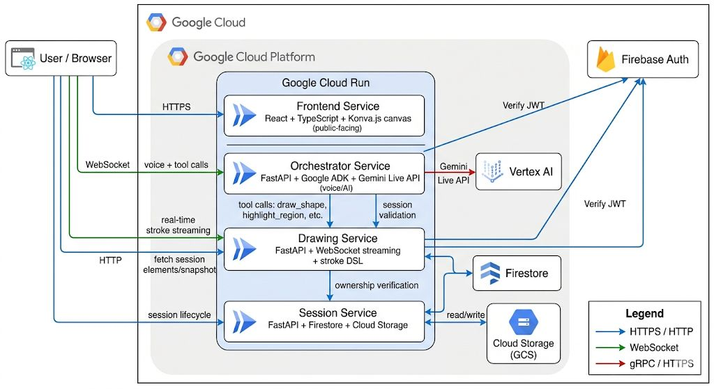

# Sona — AI Math Tutor



**Live demo:** https://sona-frontend-5h3qmaqogq-uc.a.run.app

Sona is a voice-first AI math tutor with a live collaborative whiteboard. Students interact via voice while Sona draws progressively on an HTML5 canvas in real-time, synchronized with speech. Built for the Google Gemini Live Agent Challenge.

---

## Architecture

Four microservices on Google Cloud Run:

| Service | Port | Description |
|---------|------|-------------|
| **Session** | 8003 | Session lifecycle — Firestore + Cloud Storage |
| **Drawing** | 8002 | Stroke DSL, WebSocket streaming |
| **Orchestrator** | 8001 | Google ADK + Gemini Live API, tool calls |
| **Frontend** | 3000 | React + TypeScript + Konva.js canvas |

Services must be started in the order above — each depends on the ones before it.

---

## Prerequisites

- Python 3.11+
- Node.js 20+
- [uv](https://docs.astral.sh/uv/getting-started/installation/):
  ```bash
  curl -LsSf https://astral.sh/uv/install.sh | sh
  ```
- A Google Cloud project with Firestore (Native mode) and Cloud Storage enabled
- A Firebase project (for auth tokens) or set `*_AUTH_ENABLED=false` for local dev

---

## Local Development

There are two env files to set up:

| File | For | How |
|------|-----|-----|
| `.env.example` → `.env` | All three Python services (session, drawing, orchestrator) | `cp .env.example .env` at repo root |
| `frontend/.env.example` → `frontend/.env.local` | Frontend (Vite build-time vars) | `cp frontend/.env.example frontend/.env.local` |

Each file has comments explaining every variable. Fill in your values before starting any service.

### Step 1 — Session Service

```bash
cd services/session
uv sync
source .venv/bin/activate
uvicorn main:app --reload --port 8003
```

**`.env` variables:**

| Variable | Required | Description |
|----------|----------|-------------|
| `GOOGLE_CLOUD_PROJECT` | yes | GCP project ID |
| `USE_FIRESTORE` | no | `false` for in-memory (dev), `true` for Firestore |
| `FIRESTORE_DATABASE` | no | Firestore database name (default: `(default)`) |
| `GCS_BUCKET` | yes (if using snapshots) | Cloud Storage bucket name |
| `SESSION_AUTH_ENABLED` | no | `false` for local dev, `true` in production |
| `SESSION_AUTH_AUDIENCE` | if auth enabled | Firebase project ID |
| `FRONTEND_URL` | no | Allowed CORS origin (default: `http://localhost:3000`) |

Verify it works:
```bash
curl http://localhost:8003/health
```

---

### Step 2 — Drawing Service

```bash
cd services/drawing
uv sync
source .venv/bin/activate
uvicorn main:app --reload --port 8002
```

**`.env` variables:**

| Variable | Required | Description |
|----------|----------|-------------|
| `GOOGLE_CLOUD_PROJECT` | yes (if Firestore) | GCP project ID |
| `USE_FIRESTORE` | no | `false` for in-memory (dev) |
| `FIRESTORE_DATABASE` | no | Firestore database name |
| `SESSION_SERVICE_URL` | yes | URL of the session service (`http://localhost:8003`) |
| `DRAWING_AUTH_ENABLED` | no | `false` for local dev |
| `DRAWING_AUTH_AUDIENCE` | if auth enabled | Firebase project ID |
| `FRONTEND_URL` | no | Allowed CORS origin |

Verify it works:
```bash
curl http://localhost:8002/health
```

---

### Step 3 — Orchestrator

```bash
cd services/orchestrator
uv sync
source .venv/bin/activate
uvicorn main:app --reload --port 8001
```

**`.env` variables:**

| Variable | Required | Description |
|----------|----------|-------------|
| `GOOGLE_GENAI_USE_VERTEXAI` | no | `true` to use Vertex AI (GCP), `false` for API key |
| `GOOGLE_API_KEY` | if not Vertex AI | Gemini API key from Google AI Studio |
| `GOOGLE_CLOUD_PROJECT` | if Vertex AI | GCP project ID |
| `GOOGLE_CLOUD_LOCATION` | if Vertex AI | Region (default: `us-central1`) |
| `SESSION_SERVICE_URL` | yes | URL of the session service (`http://localhost:8003`) |
| `DRAWING_SERVICE_URL` | yes | URL of the drawing service (`http://localhost:8002`) |
| `ORCHESTRATOR_AUTH_ENABLED` | no | `false` for local dev |
| `ORCHESTRATOR_AUTH_AUDIENCE` | if auth enabled | Firebase project ID |

Verify it works:
```bash
curl http://localhost:8001/health
```

---

### Step 4 — Frontend

```bash
cd frontend
cp .env.example .env.local   # see frontend/.env.example for all required vars
npm install
npm run dev   # http://localhost:3000
```

**`.env.local` variables:**

| Variable | Required | Description |
|----------|----------|-------------|
| `VITE_FIREBASE_API_KEY` | yes | Firebase Web API key (Firebase Console → Project Settings) |
| `VITE_SESSION_HTTP_BASE` | yes | Session service URL (`http://localhost:8003`) |
| `VITE_DRAWING_HTTP_BASE` | yes | Drawing service HTTP URL (`http://localhost:8002`) |
| `VITE_DRAWING_WS_BASE` | yes | Drawing service WebSocket URL (`ws://localhost:8002`) |
| `VITE_ORCHESTRATOR_WS_BASE` | yes | Orchestrator WebSocket URL (`ws://localhost:8001`) |

---

## Running Tests

### Session Service

```bash
cd services/session
source .venv/bin/activate
python -m pytest
```

### Drawing Service

```bash
cd services/drawing
source .venv/bin/activate
python -m pytest
```

### Orchestrator

```bash
cd services/orchestrator
source .venv/bin/activate
python -m pytest
```

### Frontend (type-check + build)

```bash
cd frontend
npm run build
```

---

## Deployment

### Automated (CI/CD)

Every push to `main` triggers `.github/workflows/deploy.yml`, which builds and deploys all 4 services to Cloud Run.

**Required GitHub secrets** (Settings → Secrets → Actions):

| Secret | Description |
|--------|-------------|
| `GCP_SA_KEY` | GCP service account JSON key |
| `VITE_FIREBASE_API_KEY` | Firebase Web API key |
| `VITE_SESSION_HTTP_BASE` | Deployed session service URL |
| `VITE_DRAWING_HTTP_BASE` | Deployed drawing service URL |
| `VITE_DRAWING_WS_BASE` | Deployed drawing service WebSocket URL |
| `VITE_ORCHESTRATOR_WS_BASE` | Deployed orchestrator WebSocket URL |

### Manual

```bash
gcloud auth login
gcloud config set project project-c3019c85-4428-4c46-9c2
bash infra/deploy.sh
```

---

## Deployed Service URLs

| Service | URL |
|---------|-----|
| Frontend | https://sona-frontend-5h3qmaqogq-uc.a.run.app |
| Session | https://sona-session-5h3qmaqogq-uc.a.run.app |
| Drawing | https://sona-drawing-5h3qmaqogq-uc.a.run.app |
| Orchestrator | https://sona-orchestrator-5h3qmaqogq-uc.a.run.app |

